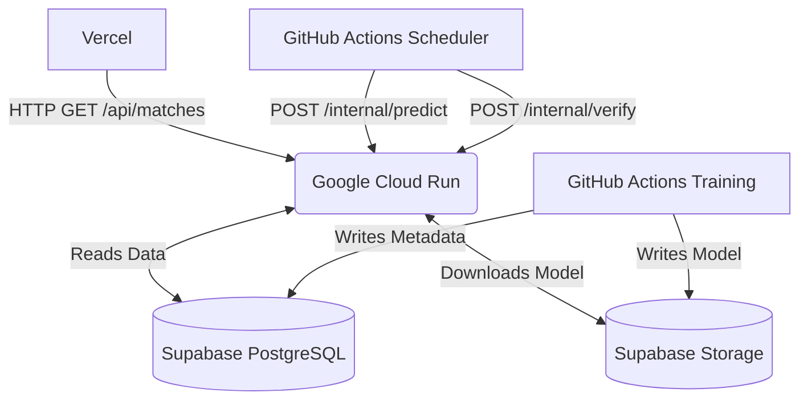

# GlobalPulse Architecture

## Core Philosophy
GlobalPulse is designed to be a 100% Free, Cloud-Native, Stateless, and Event-Driven Machine Learning platform.

## Infrastructure Map

## Key Components

1. **Prediction API (Cloud Run)**: A FastAPI application running in a stateless Docker container. It downloads the champion `.joblib` model into memory on startup and serves prediction probabilities and SHAP explanations.
2. **Model Manager**: Abstract layer interacting with Supabase Storage to ensure version control and checksum validation of the trained machine learning models.
3. **Continuous Learning Engine**: The brain. Generates live features (cricket statistics, astronomy, ancient logic) and processes match verifications to detect model drift.
4. **GitHub Actions Automations**: Replaces traditional server daemons (cron). Uses isolated runners for heavy, memory-intensive training loops to avoid hitting free-tier limits on the API.
